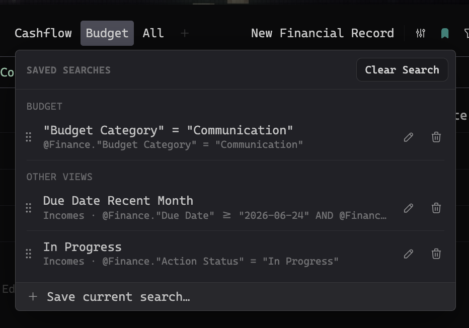

# Saved Searches

Saved Searches is a [Thymer](https://thymer.com) plugin that lets you save the queries you type into a collection view's filter field, give each one a title, and re-run it later from a bookmark button in the view's toolbar.

Thymer already keeps pinned searches for the global Search panel, but the per-view filter field forgets a query the moment you clear it. This plugin remembers the ones worth keeping, so a filter you spent a minute composing is one click away next time.

## How to use

Open any collection view. In the toolbar, next to the filter and sort buttons, there's a **bookmark button**. It's a filled bookmark when the collection already has saved searches, an outline when it doesn't.

- **Save** — type a query into the filter field, click the bookmark, choose **Save current search…**, give it a title, press Enter. The title is pre-filled with the query (minus the leading `@Collection.`), so you can just hit Enter.
- **Run** — click a saved search and it drops into the filter field and runs, exactly as if you'd typed it.
- **Edit the query** — run a saved search, tweak the query in the filter field, then reopen the list. The footer now offers **Update "«Title»"** to save your change in place, or **Save as a new search** to keep both.
- **Rename** — hover a row and click the pencil.
- **Delete** — hover a row and click the trash.
- **Reorder** — drag the grip on the left of a row to reorder within its group.
- **Move between views** — drag a search into another view's section to move it there, or into **Whole collection** to make it show in every view. Empty sections appear as drop targets while you drag, so you can always drop into the current view or make a search global even when nothing is there yet. A dropped search keeps the exact spot you release it at.
- **Clear Search** — the button in the popup's header empties the filter field. Handy on mobile, where the field's own clear button is fiddly to hit.

Saved searches are grouped **per collection**. Within a collection, the searches saved in the view you're looking at are listed first, then any **Whole collection** searches (shown in every view), then the rest under **Other views**.

## Installation

1. In Thymer, open the Command Palette (`Cmd+P` / `Ctrl+P`), run **Plugins**, and click **Create Plugin** under Global Plugins.
2. In the plugin's dialog, go to the code editor (click **Edit as Code** if you see the settings view).
3. In the **Custom Code** tab, replace the contents with [`plugin.js`](plugin.js).
4. In the **Configuration** tab, replace the contents with [`plugin.json`](plugin.json).
5. Click **Save**.

Don't enable Hot Reload — it's a development feature and can leave the plugin in a state where saved data stops persisting.

## Where your saved searches live

They're stored in the plugin's own configuration, so they sync with your workspace across devices and the web client. A copy is also kept in the browser's local storage as a safety net, and the newer of the two always wins on load.

Because writing the configuration reloads the plugin (which would clear whatever is typed in the filter field), the plugin defers that write until the field is empty — your saved searches are never lost, and an in-progress query is never wiped out from under you.

## How it works

- The filter field is a plain `<input>` in Thymer's DOM. Saving reads its value; running sets the value and fires the same `input` event typing would, so Thymer runs the search normally.
- The collection is identified by the page GUID on the view's heading; the active view by the pressed view-switcher button (with a fallback to the focused view's config so grouping still works on mobile, where there's no such button).
- The popup borrows Thymer's own command-palette colours and typography, so it follows every theme, light or dark.

## License

[MIT](LICENSE)
